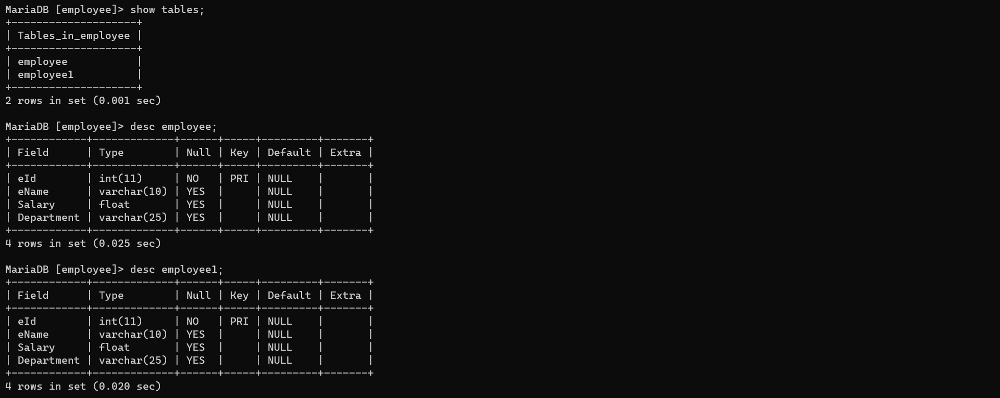

# MySQL

```sql
10.4.24-MariaDB

xampp\mysql\bin

mysql -u root -p -h 127.0.0.1

--to clear screen
system cls;
```

### LAB 1

- 1. CREATE DB CSIT & CSIT4th
    
    ```sql
    CREATE DATABASE csit;
    ```
    
    ```sql
    CREATE DATABASE csit4th;
    ```
    
    ---
    
    O/P
    
    ```sql
    show databases;
    ```
    
    ```sql
    +--------------------+
    | Database           |
    +--------------------+
    | csit               |
    | csit4th            |
    +--------------------+
    ```
    
- 2. DROP DB CSIT
    
    ```sql
    DROP DATABASE csit;
    ```
    
    ---
    
    O/P
    
    ```sql
    show databases;
    ```
    
    ```sql
    +--------------------+
    | Database           |
    +--------------------+
    | csit4th            |
    +--------------------+
    ```
    
- 3. RENAME DB CSIT4th to CSITFourth
    
    ```sql
    N/A
    ```
    
- 4. ACCESS DB CSITFourth
    
    ```sql
    USE csitfourth;
    ```
    
    ```sql
    --output
    MariaDB [(none)]> USE csitfourth;
    Database changed
    MariaDB [csitfourth]>
    ```
    
- 5. CREATE table CSITRECORD and CSIT with given fields
    
    ```sql
    CREATE TABLE csitrecord
      (
         Roll_no INT(6) PRIMARY KEY,
         Name    VARCHAR(15),
         Dept    VARCHAR(4),
         City    VARCHAR(15),
         DOB     DATE NOT NULL,
         Gender  CHAR(1)
      );
    ```
    
    ```sql
    CREATE TABLE csit
      (
         Roll_no INT(6) PRIMARY KEY,
         Name    VARCHAR(15),
         Dept    VARCHAR(4),
         City    VARCHAR(15),
         DOB     DATE NOT NULL,
         Gender  CHAR(1)
      );
    ```
    
    ---
    
    O/P
    
    ```sql
    show TABLES;
    ```
    
    ```sql
    +----------------------+
    | Tables_in_csitfourth |
    +----------------------+
    | csit                 |
    | csitrecord           |
    +----------------------+
    ```
    
    ```sql
    desc csitrecord;
    ```
    
    ```sql
    +---------+-------------+------+-----+---------+-------+
    | Field   | Type        | Null | Key | Default | Extra |
    +---------+-------------+------+-----+---------+-------+
    | Roll_no | int(6)      | NO   | PRI | NULL    |       |
    | Name    | varchar(15) | YES  |     | NULL    |       |
    | Dept    | varchar(4)  | YES  |     | NULL    |       |
    | City    | varchar(15) | YES  |     | NULL    |       |
    | DOB     | date        | NO   |     | NULL    |       |
    | Gender  | char(1)     | YES  |     | NULL    |       |
    +---------+-------------+------+-----+---------+-------+
    ```
    
    ```sql
    desc csit;
    ```
    
    ```sql
    +---------+-------------+------+-----+---------+-------+
    | Field   | Type        | Null | Key | Default | Extra |
    +---------+-------------+------+-----+---------+-------+
    | roll_no | int(6)      | NO   | PRI | NULL    |       |
    | name    | varchar(15) | YES  |     | NULL    |       |
    | dept    | varchar(4)  | YES  |     | NULL    |       |
    | city    | varchar(15) | YES  |     | NULL    |       |
    | dob     | date        | NO   |     | NULL    |       |
    | gender  | char(1)     | YES  |     | NULL    |       |
    +---------+-------------+------+-----+---------+-------+
    ```
    
- 6. DROP table CSIT from DB CSITFourth
    
    ```sql
    DROP TABLE csit;
    ```
    
    ---
    
    O/P
    
    ```sql
    show TABLES;
    ```
    
    ```sql
    +----------------------+
    | Tables_in_csitfourth |
    +----------------------+
    | csitrecord           |
    +----------------------+
    ```
    
- 7. ADD 3 attr. Contact(int), Contact1 and District in CSITRecord
    
    ```sql
    ALTER TABLE csitrecord
      ADD COLUMN Contact INT,
      ADD COLUMN Contact1 VARCHAR(6),
      ADD COLUMN District VARCHAR(8);
    ```
    
    ---
    
    O/P
    
    ```sql
    desc csitrecord;
    ```
    
    ```sql
    +----------+-------------+------+-----+---------+-------+
    | Field    | Type        | Null | Key | Default | Extra |
    +----------+-------------+------+-----+---------+-------+
    | Roll_no  | int(6)      | NO   | PRI | NULL    |       |
    | Name     | varchar(15) | YES  |     | NULL    |       |
    | Dept     | varchar(4)  | YES  |     | NULL    |       |
    | City     | varchar(15) | YES  |     | NULL    |       |
    | DOB      | date        | NO   |     | NULL    |       |
    | Gender   | char(1)     | YES  |     | NULL    |       |
    | Contact  | int(11)     | YES  |     | NULL    |       |
    | Contact1 | varchar(6)  | YES  |     | NULL    |       |
    | District | varchar(8)  | YES  |     | NULL    |       |
    +----------+-------------+------+-----+---------+-------+
    ```
    
- 8. RENAME table name CSITRecord to CSITStd
    
    ```sql
    ALTER TABLE csitrecord
      RENAME TO csitstd;
    ```
    
    ---
    
    O/P
    
    ```sql
    show TABLES;
    ```
    
    ```sql
    +----------------------+
    | Tables_in_csitfourth |
    +----------------------+
    | csitstd              |
    +----------------------+
    ```
    
- 9. DELETE col. Contact1 and City from table CSITStd
    
    ```sql
    ALTER TABLE csitstd
      DROP COLUMN contact1,
      DROP COLUMN city;
    ```
    
    ---
    
    O/P
    
    ```sql
    desc csitstd;
    ```
    
    ```sql
    +----------+-------------+------+-----+---------+-------+
    | Field    | Type        | Null | Key | Default | Extra |
    +----------+-------------+------+-----+---------+-------+
    | Roll_no  | int(6)      | NO   | PRI | NULL    |       |
    | Name     | varchar(15) | YES  |     | NULL    |       |
    | Dept     | varchar(4)  | YES  |     | NULL    |       |
    | DOB      | date        | NO   |     | NULL    |       |
    | Gender   | char(1)     | YES  |     | NULL    |       |
    | Contact  | int(11)     | YES  |     | NULL    |       |
    | District | varchar(8)  | YES  |     | NULL    |       |
    +----------+-------------+------+-----+---------+-------+
    ```
    
- 10. Change datatype of col. Contact from int to varchar
    
    ```sql
    ALTER TABLE csitstd
      modify COLUMN Contact VARCHAR(8);
    ```
    
    ---
    
    O/P
    
    ```sql
    desc csitstd;
    ```
    
    ```sql
    +----------+-------------+------+-----+---------+-------+
    | Field    | Type        | Null | Key | Default | Extra |
    +----------+-------------+------+-----+---------+-------+
    | Roll_no  | int(6)      | NO   | PRI | NULL    |       |
    | Name     | varchar(15) | YES  |     | NULL    |       |
    | Dept     | varchar(4)  | YES  |     | NULL    |       |
    | DOB      | date        | NO   |     | NULL    |       |
    | Gender   | char(1)     | YES  |     | NULL    |       |
    | Contact  | varchar(8)  | YES  |     | NULL    |       |
    | District | varchar(8)  | YES  |     | NULL    |       |
    +----------+-------------+------+-----+---------+-------+
    ```
    
- 11. Change name of attr. Contact to Phone_no
    
    ```sql
    ALTER TABLE csitstd
      CHANGE Contact Phone_no VARCHAR(10);
    ```
    
    ---
    
    O/P
    
    ```sql
    desc csitstd;
    ```
    
    ```sql
    +----------+-------------+------+-----+---------+-------+
    | Field    | Type        | Null | Key | Default | Extra |
    +----------+-------------+------+-----+---------+-------+
    | Roll_no  | int(6)      | NO   | PRI | NULL    |       |
    | Name     | varchar(15) | YES  |     | NULL    |       |
    | Dept     | varchar(4)  | YES  |     | NULL    |       |
    | DOB      | date        | NO   |     | NULL    |       |
    | Gender   | char(1)     | YES  |     | NULL    |       |
    | Phone_no | varchar(10) | YES  |     | NULL    |       |
    | District | varchar(8)  | YES  |     | NULL    |       |
    +----------+-------------+------+-----+---------+-------+
    ```
    
- 12. Display structure of CSITStd
    
    ```sql
    desc csitstd;
    ```
    
    ```sql
    +----------+-------------+------+-----+---------+-------+
    | Field    | Type        | Null | Key | Default | Extra |
    +----------+-------------+------+-----+---------+-------+
    | Roll_no  | int(6)      | NO   | PRI | NULL    |       |
    | Name     | varchar(15) | YES  |     | NULL    |       |
    | Dept     | varchar(4)  | YES  |     | NULL    |       |
    | DOB      | date        | NO   |     | NULL    |       |
    | Gender   | char(1)     | YES  |     | NULL    |       |
    | Phone_no | varchar(10) | YES  |     | NULL    |       |
    | District | varchar(8)  | YES  |     | NULL    |       |
    +----------+-------------+------+-----+---------+-------+
    ```
    

### LAB 2

- INSERT
    - Insert five records into whole table ‘CSITStd’
        
        ```sql
        INSERT INTO csitstd
        VALUES
        			(1, 'A', 'SCI', '2000-11-30', 'M', 1234567890, 'KTM'),
        			(2, 'B', 'MATH', '2000-8-15', 'F', 9234567890, 'PKR'),
        			(3, 'C', 'SCI', '1999-5-5', 'F', 9834567890, 'ABC'),
        			(4, 'D', 'MATH', '2001-2-6', 'M', 9844567890, 'PKR'),
        			(5, 'E', 'ENG', '2001-6-8', 'M', 9841567890, 'KTM');
        ```
        
        ---
        
        O/P
        
        ```sql
        SELECT *
        FROM   csitstd;
        ```
        
        ```sql
        +---------+------+------+------------+--------+------------+----------+
        | Roll_no | Name | Dept | DOB        | Gender | Phone_no   | District |
        +---------+------+------+------------+--------+------------+----------+
        |       1 | A    | SCI  | 2000-11-30 | M      | 1234567890 | KTM      |
        |       2 | B    | MATH | 2000-08-15 | F      | 9234567890 | PKR      |
        |       3 | C    | SCI  | 1999-05-05 | F      | 9834567890 | ABC      |
        |       4 | D    | MATH | 2001-02-06 | M      | 9844567890 | PKR      |
        |       5 | E    | ENG  | 2001-06-08 | M      | 9841567890 | KTM      |
        +---------+------+------+------------+--------+------------+----------+
        ```
        
    - Insert data into specific col. Roll_no, Name, Dept and DOB
        
        ```sql
        INSERT INTO csitstd (roll_no, name, dept, dob)
        VALUES      
        			(6, 'F', 'NEP', '1999-4-16'),
        			(7, 'G', 'IT', '2002-2-17');
        ```
        
        ---
        
        O/P
        
        ```sql
        SELECT *
        FROM   csitstd;
        ```
        
        ```sql
        +---------+------+------+------------+--------+------------+----------+
        | Roll_no | Name | Dept | DOB        | Gender | Phone_no   | District |
        +---------+------+------+------------+--------+------------+----------+
        |       1 | A    | SCI  | 2000-11-30 | M      | 1234567890 | KTM      |
        |       2 | B    | MATH | 2000-08-15 | F      | 9234567890 | PKR      |
        |       3 | C    | SCI  | 1999-05-05 | F      | 9834567890 | ABC      |
        |       4 | D    | MATH | 2001-02-06 | M      | 9844567890 | PKR      |
        |       5 | E    | ENG  | 2001-06-08 | M      | 9841567890 | KTM      |
        |       6 | F    | NEP  | 1999-04-16 | NULL   | NULL       | NULL     |
        |       7 | G    | IT   | 2002-02-17 | NULL   | NULL       | NULL     |
        +---------+------+------+------------+--------+------------+----------+
        ```
        
- SELECT
    - Display detail records of student
        
        ```sql
        SELECT *
        FROM   csitstd;
        ```
        
        ```sql
        +---------+------+------+------------+--------+------------+----------+
        | Roll_no | Name | Dept | DOB        | Gender | Phone_no   | District |
        +---------+------+------+------------+--------+------------+----------+
        |       1 | A    | SCI  | 2000-11-30 | M      | 1234567890 | KTM      |
        |       2 | B    | MATH | 2000-08-15 | F      | 9234567890 | PKR      |
        |       3 | C    | SCI  | 1999-05-05 | F      | 9834567890 | ABC      |
        |       4 | D    | MATH | 2001-02-06 | M      | 9844567890 | PKR      |
        |       5 | E    | ENG  | 2001-06-08 | M      | 9841567890 | KTM      |
        |       6 | F    | NEP  | 1999-04-16 | NULL   | NULL       | NULL     |
        |       7 | G    | IT   | 2002-02-17 | NULL   | NULL       | NULL     |
        +---------+------+------+------------+--------+------------+----------+
        ```
        
    - Display all student names and their deptartment names in department name order
        
        ```sql
        SELECT name, dept
        FROM   csitstd
        ORDER  BY dept;
        ```
        
        ```sql
        +------+------+
        | name | dept |
        +------+------+
        | E    | ENG  |
        | G    | IT   |
        | B    | MATH |
        | D    | MATH |
        | F    | NEP  |
        | A    | SCI  |
        | C    | SCI  |
        +------+------+
        ```
        
- UPDATE
    - Update City ‘Kathmandu’ to ‘Pokhara’ of student whose Roll_no is 3
        
        ```sql
        UPDATE csitstd
        SET    district = 'PKR'
        WHERE  roll_no = 3;
        ```
        
        ---
        
        O/P
        
        ```sql
        SELECT *
        FROM   csitstd;
        ```
        
        ```sql
        +---------+------+------+------------+--------+------------+----------+
        | Roll_no | Name | Dept | DOB        | Gender | Phone_no   | District |
        +---------+------+------+------------+--------+------------+----------+
        |       1 | A    | SCI  | 2000-11-30 | M      | 1234567890 | KTM      |
        |       2 | B    | MATH | 2000-08-15 | F      | 9234567890 | PKR      |
        |       3 | C    | SCI  | 1999-05-05 | F      | 9834567890 | PKR      |
        |       4 | D    | MATH | 2001-02-06 | M      | 9844567890 | PKR      |
        |       5 | E    | ENG  | 2001-06-08 | M      | 9841567890 | KTM      |
        |       6 | F    | NEP  | 1999-04-16 | NULL   | NULL       | NULL     |
        |       7 | G    | IT   | 2002-02-17 | NULL   | NULL       | NULL     |
        +---------+------+------+------------+--------+------------+----------+
        ```
        
    - ‘IS NULL’ : Set all NULL Dept to IT
        
        ```sql
        UPDATE csitstd
        SET    dept = 'IT'
        WHERE  dept is NULL;
        ```
        
        ---
        
        O/P
        
        ```sql
        --BEFORE
        
        SELECT *
        FROM   csitstd;
        ```
        
        ```sql
        +---------+------+------+------------+--------+------------+----------+
        | Roll_no | Name | Dept | DOB        | Gender | Phone_no   | District |
        +---------+------+------+------------+--------+------------+----------+
        |       1 | A    | SCI  | 2000-11-30 | M      | 1234567890 | KTM      |
        |       2 | B    | MATH | 2000-08-15 | F      | 9234567890 | PKR      |
        |       3 | C    | SCI  | 1999-05-05 | F      | 9834567890 | PKR      |
        |       4 | D    | MATH | 2001-02-06 | M      | 9844567890 | PKR      |
        |       5 | E    | ENG  | 2001-06-08 | M      | 9841567890 | KTM      |
        |       6 | F    | NEP  | 1999-04-16 | NULL   | NULL       | NULL     |
        |       7 | G    | IT   | 2002-02-17 | NULL   | NULL       | NULL     |
        |       8 | H    | NULL | 1998-05-06 | NULL   | NULL       | NULL     |
        |       9 | I    | NULL | 2000-04-03 | NULL   | NULL       | NULL     |
        +---------+------+------+------------+--------+------------+----------+
        ```
        
        ```sql
        --AFTER
        
        SELECT *
        FROM   csitstd;
        ```
        
        ```sql
        +---------+------+------+------------+--------+------------+----------+
        | Roll_no | Name | Dept | DOB        | Gender | Phone_no   | District |
        +---------+------+------+------------+--------+------------+----------+
        |       1 | A    | SCI  | 2000-11-30 | M      | 1234567890 | KTM      |
        |       2 | B    | MATH | 2000-08-15 | F      | 9234567890 | PKR      |
        |       3 | C    | SCI  | 1999-05-05 | F      | 9834567890 | PKR      |
        |       4 | D    | MATH | 2001-02-06 | M      | 9844567890 | PKR      |
        |       5 | E    | ENG  | 2001-06-08 | M      | 9841567890 | KTM      |
        |       6 | F    | NEP  | 1999-04-16 | NULL   | NULL       | NULL     |
        |       7 | G    | IT   | 2002-02-17 | NULL   | NULL       | NULL     |
        |       8 | H    | IT   | 1998-05-06 | NULL   | NULL       | NULL     |
        |       9 | I    | IT   | 2000-04-03 | NULL   | NULL       | NULL     |
        +---------+------+------+------------+--------+------------+----------+
        ```
        
- DELETE
    - Delete record of those student whose District is  ‘KTM’
        
        ```sql
        DELETE FROM csitstd
        WHERE  district = 'KTM';
        ```
        
        ---
        
        O/P
        
        ```sql
        --BEFORE
        
        SELECT *
        FROM   csitstd;
        ```
        
        ```sql
        +---------+------+------+------------+--------+------------+----------+
        | Roll_no | Name | Dept | DOB        | Gender | Phone_no   | District |
        +---------+------+------+------------+--------+------------+----------+
        |       1 | A    | SCI  | 2000-11-30 | M      | 1234567890 | KTM      |
        |       2 | B    | MATH | 2000-08-15 | F      | 9234567890 | PKR      |
        |       3 | C    | SCI  | 1999-05-05 | F      | 9834567890 | PKR      |
        |       4 | D    | MATH | 2001-02-06 | M      | 9844567890 | PKR      |
        |       5 | E    | ENG  | 2001-06-08 | M      | 9841567890 | KTM      |
        |       6 | F    | NEP  | 1999-04-16 | NULL   | NULL       | NULL     |
        |       7 | G    | IT   | 2002-02-17 | NULL   | NULL       | NULL     |
        |       8 | H    | IT   | 1998-05-06 | NULL   | NULL       | NULL     |
        |       9 | I    | IT   | 2000-04-03 | NULL   | NULL       | NULL     |
        +---------+------+------+------------+--------+------------+----------+
        ```
        
        ```sql
        --AFTER
        
        SELECT *
        FROM   csitstd;
        ```
        
        ```sql
        +---------+------+------+------------+--------+------------+----------+
        | Roll_no | Name | Dept | DOB        | Gender | Phone_no   | District |
        +---------+------+------+------------+--------+------------+----------+
        |       2 | B    | MATH | 2000-08-15 | F      | 9234567890 | PKR      |
        |       3 | C    | SCI  | 1999-05-05 | F      | 9834567890 | PKR      |
        |       4 | D    | MATH | 2001-02-06 | M      | 9844567890 | PKR      |
        |       6 | F    | NEP  | 1999-04-16 | NULL   | NULL       | NULL     |
        |       7 | G    | IT   | 2002-02-17 | NULL   | NULL       | NULL     |
        |       8 | H    | IT   | 1998-05-06 | NULL   | NULL       | NULL     |
        |       9 | I    | IT   | 2000-04-03 | NULL   | NULL       | NULL     |
        +---------+------+------+------------+--------+------------+----------+
        ```
        
    - Delete record of those student whose Gender is ‘NULL’
        
        ```sql
        DELETE FROM csitstd
        WHERE  gender IS NULL;
        ```
        
        ---
        
        O/P
        
        ```sql
        --BEFORE
        
        SELECT *
        FROM   csitstd;
        ```
        
        ```sql
        +---------+------+------+------------+--------+------------+----------+
        | Roll_no | Name | Dept | DOB        | Gender | Phone_no   | District |
        +---------+------+------+------------+--------+------------+----------+
        |       2 | B    | MATH | 2000-08-15 | F      | 9234567890 | PKR      |
        |       3 | C    | SCI  | 1999-05-05 | F      | 9834567890 | PKR      |
        |       4 | D    | MATH | 2001-02-06 | M      | 9844567890 | PKR      |
        |       6 | F    | NEP  | 1999-04-16 | NULL   | NULL       | NULL     |
        |       7 | G    | IT   | 2002-02-17 | NULL   | NULL       | NULL     |
        |       8 | H    | IT   | 1998-05-06 | NULL   | NULL       | NULL     |
        |       9 | I    | IT   | 2000-04-03 | NULL   | NULL       | NULL     |
        +---------+------+------+------------+--------+------------+----------+
        ```
        
        ```sql
        --AFTER
        
        SELECT *
        FROM   csitstd;
        ```
        
        ```sql
        +---------+------+------+------------+--------+------------+----------+
        | Roll_no | Name | Dept | DOB        | Gender | Phone_no   | District |
        +---------+------+------+------------+--------+------------+----------+
        |       2 | B    | MATH | 2000-08-15 | F      | 9234567890 | PKR      |
        |       3 | C    | SCI  | 1999-05-05 | F      | 9834567890 | PKR      |
        |       4 | D    | MATH | 2001-02-06 | M      | 9844567890 | PKR      |
        +---------+------+------+------------+--------+------------+----------+
        ```
        

### LAB 3

- **Create table employee and employee1 for mathematics and computer department**
    - employee
        
        ```sql
        create table employee(eId int not null primary key, eName varchar(10), Salary float, Department varchar(25));
        ```
        
    - employee1
        
        ```sql
        create table employee1(eId int not null primary key, eName varchar(10), Salary float, Department varchar(25));
        ```
        
    - table info
        
        
        
    - insert values
        
        ```sql
        insert into employee
        values
        			(1, 'A', 20000, 'Mathematics'),
        			(2, 'B', 25000, 'Mathematics'),
        			(3, 'C', 30000, 'Mathematics'),
        			(4, 'D', 35000, 'Mathematics');
        ```
        
        ```sql
        insert into employee1
        values
        			(3, 'C', 10000, 'Computer'),
        			(4, 'D', 10000, 'Computer'),
        			(101, 'E', 20000, 'Computer'),
        			(102, 'F', 60000, 'Computer');
        ```
        
        
        
- **Union (UNION, UNION ALL)**
    - display detail record of all employees from mathematics and computer department
        
        ```sql
        select *from employee
        union
        select *from employee1;
        ```
        
        ```sql
        +-----+-------+--------+-------------+
        | eId | eName | Salary | Department  |
        +-----+-------+--------+-------------+
        |   1 | A     |  20000 | Mathematics |
        |   2 | B     |  25000 | Mathematics |
        |   3 | C     |  30000 | Mathematics |
        |   4 | D     |  35000 | Mathematics |
        |   3 | C     |  10000 | Computer    |
        |   4 | D     |  10000 | Computer    |
        | 101 | E     |  20000 | Computer    |
        | 102 | F     |  60000 | Computer    |
        +-----+-------+--------+-------------+
        ```
        
- **Intersection (INTERSECT)**
    - display record of those employee who belong to both computer and mathematics department
        
        ```sql
        select * from employee e, employee1 em
        where e.eid = em.eid
        intersect
        select * from employee e, employee1 em
        where e.eid = em.eid;
        ```
        
        ```sql
        +-----+-------+--------+-------------+-----+-------+--------+------------+
        | eId | eName | Salary | Department  | eId | eName | Salary | Department |
        +-----+-------+--------+-------------+-----+-------+--------+------------+
        |   3 | C     |  30000 | Mathematics |   3 | C     |  10000 | Computer   |
        |   4 | D     |  35000 | Mathematics |   4 | D     |  10000 | Computer   |
        +-----+-------+--------+-------------+-----+-------+--------+------------+
        ```
        
- **Difference**
    
    ```sql
    select e.ename, e.eid from employee e, employee1 em
    except
    select em.ename, em.eid from employee e, employee1 em;
    ```
    
    ```sql
    +-------+-----+
    | ename | eid |
    +-------+-----+
    | A     |   1 |
    | B     |   2 |
    +-------+-----+
    ```
    
- **Cartesian Product**
    
    ```sql
    select *from employee, employee1;
    ```
    
    ```sql
    +-----+-------+--------+-------------+-----+-------+--------+------------+
    | eId | eName | Salary | Department  | eId | eName | Salary | Department |
    +-----+-------+--------+-------------+-----+-------+--------+------------+
    |   1 | A     |  20000 | Mathematics |   3 | C     |  10000 | Computer   |
    |   2 | B     |  25000 | Mathematics |   3 | C     |  10000 | Computer   |
    |   3 | C     |  30000 | Mathematics |   3 | C     |  10000 | Computer   |
    |   4 | D     |  35000 | Mathematics |   3 | C     |  10000 | Computer   |
    |   1 | A     |  20000 | Mathematics |   4 | D     |  10000 | Computer   |
    |   2 | B     |  25000 | Mathematics |   4 | D     |  10000 | Computer   |
    |   3 | C     |  30000 | Mathematics |   4 | D     |  10000 | Computer   |
    |   4 | D     |  35000 | Mathematics |   4 | D     |  10000 | Computer   |
    |   1 | A     |  20000 | Mathematics | 101 | E     |  20000 | Computer   |
    |   2 | B     |  25000 | Mathematics | 101 | E     |  20000 | Computer   |
    |   3 | C     |  30000 | Mathematics | 101 | E     |  20000 | Computer   |
    |   4 | D     |  35000 | Mathematics | 101 | E     |  20000 | Computer   |
    |   1 | A     |  20000 | Mathematics | 102 | F     |  60000 | Computer   |
    |   2 | B     |  25000 | Mathematics | 102 | F     |  60000 | Computer   |
    |   3 | C     |  30000 | Mathematics | 102 | F     |  60000 | Computer   |
    |   4 | D     |  35000 | Mathematics | 102 | F     |  60000 | Computer   |
    +-----+-------+--------+-------------+-----+-------+--------+------------+
    ```
    
- **Join Operation**
    - Inner Join
        
        ```sql
        select e.emp_name, e.street, e.city from emp e inner join worker;
        ```
        
    - Left Outer Join
        
        ```sql
        select * from emp left join worker on (emp.emp_name = worker.emp_name);
        ```
        
    - Right Outer Join
        
        ```sql
        select * from emp right join worker on (emp.emp_name = worker.emp_name);
        ```
        
    - Full Outer Join

### **LAB 4**

- create table Product(pid, pname, price, quantity);
    
    ```sql
    --create a table
    create table product(pid int not null primary key, pname varchar(15), price float, quantity int);
    ```
    
    ```sql
    --desc of 'product' table
    +----------+-------------+------+-----+---------+-------+
    | Field    | Type        | Null | Key | Default | Extra |
    +----------+-------------+------+-----+---------+-------+
    | pid      | int(11)     | NO   | PRI | NULL    |       |
    | pname    | varchar(15) | YES  |     | NULL    |       |
    | price    | float       | YES  |     | NULL    |       |
    | quantity | int(11)     | YES  |     | NULL    |       |
    +----------+-------------+------+-----+---------+-------+
    ```
    
- increase price of all product by 5%
    - Values
        
        ```sql
        --insert values
        INSERT INTO product 
        VALUES
        			(100, 'P0', 2000, 5),
        			(101, 'P1', 3000, 3),
        			(102, 'P2', 5500, 7),
        			(103, 'P3', 7700, 9),
        			(104, 'P4', 6000, 4);
        ```
        
        ```sql
        --values in table
        +-----+-------+-------+----------+
        | pid | pname | price | quantity |
        +-----+-------+-------+----------+
        | 100 | P0    |  2000 |        5 |
        | 101 | P1    |  3000 |        3 |
        | 102 | P2    |  5500 |        7 |
        | 103 | P3    |  7700 |        9 |
        | 104 | P4    |  6000 |        4 |
        +-----+-------+-------+----------+
        ```
        
    
    ```sql
    UPDATE product
    SET price = price * 1.05;
    ```
    
    ```sql
    --before
    +-----+-------+-------+----------+
    | pid | pname | price | quantity |
    +-----+-------+-------+----------+
    | 100 | P0    |  2000 |        5 |
    | 101 | P1    |  3000 |        3 |
    | 102 | P2    |  5500 |        7 |
    | 103 | P3    |  7700 |        9 |
    | 104 | P4    |  6000 |        4 |
    +-----+-------+-------+----------+
    ```
    
    ```sql
    --after
    +-----+-------+-------+----------+
    | pid | pname | price | quantity |
    +-----+-------+-------+----------+
    | 100 | P0    |  2100 |        5 |
    | 101 | P1    |  3150 |        3 |
    | 102 | P2    |  5775 |        7 |
    | 103 | P3    |  8085 |        9 |
    | 104 | P4    |  6300 |        4 |
    +-----+-------+-------+----------+
    ```
    
- display product name with highest price
    
    ```sql
    SELECT pname, price
    FROM product
    WHERE price = (
    			SELECT MAX(price)
    			FROM product
    );
    ```
    
    ```sql
    --output
    +-------+-------+
    | pname | price |
    +-------+-------+
    | P3    |  8085 |
    +-------+-------+
    ```
    
- display product name with price between 5,000 and 10,000
    
    ```sql
    SELECT pname, price FROM product
    WHERE price BETWEEN 5000 AND 10000;
    ```
    
    ```sql
    --output
    +-------+-------+
    | pname | price |
    +-------+-------+
    | P2    |  5775 |
    | P3    |  8085 |
    | P4    |  6300 |
    +-------+-------+
    ```
    
- display product name with lowest price
    
    ```sql
    SELECT pname, price
    FROM product
    WHERE price = (
    			SELECT MIN(price)
    			FROM product
    );
    ```
    
    ```sql
    --output
    +-------+-------+
    | pname | price |
    +-------+-------+
    | P0    |  2100 |
    +-------+-------+
    ```
    
- find the names of all products having price 7,000
    - Values
        
        ```sql
        --insert values
        INSERT INTO product 
        VALUES
        			(200, 'P5', 7000, 7),
        			(201, 'P6', 600, 1),
        			(202, 'P7', 600, 8),
        			(203, 'P8', 7000, 5),
        			(204, 'P9', 600, 4),
        			(205, 'P10', 600, 6);
        ```
        
        ```sql
        --values in table
        +-----+-------+-------+----------+
        | pid | pname | price | quantity |
        +-----+-------+-------+----------+
        | 100 | P0    |  2100 |        5 |
        | 101 | P1    |  3150 |        3 |
        | 102 | P2    |  5775 |        7 |
        | 103 | P3    |  8085 |        9 |
        | 104 | P4    |  6300 |        4 |
        | 200 | P5    |  7000 |        7 |
        | 201 | P6    |   600 |        1 |
        | 202 | P7    |   600 |        8 |
        | 203 | P8    |  7000 |        5 |
        | 204 | P9    |   600 |        4 |
        | 205 | P10   |   600 |        6 |
        +-----+-------+-------+----------+
        ```
        
    
    ```sql
    SELECT pname, price
    FROM product
    WHERE price = 7000;
    ```
    
    ```sql
    --output
    +-------+-------+
    | pname | price |
    +-------+-------+
    | P5    |  7000 |
    | P8    |  7000 |
    +-------+-------+
    ```
    
- find the total number of product with price 600
    
    ```sql
    SELECT COUNT(price) AS PriceIs600
    FROM product
    WHERE price = 600;
    ```
    
    ```sql
    --output
    +------------+
    | PriceIs600 |
    +------------+
    |          4 |
    +------------+
    ```